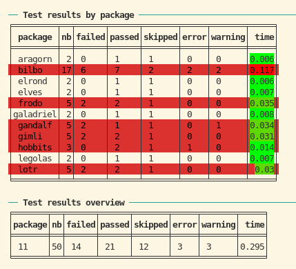

# Testing and checking packages with srcpkgs

I will demonstrate srcpkgs using a dummy collection of source packages:
<https://github.com/kforner/srcpkgs_lotr_demo> It consists currently in
11 related packages, with internal dependencies. The dependencies are
implemented by a mix of Imports, Imports with namespace imports and
Depends.

## listing the LOTR collection of packages with srcpkgs

``` r
library(srcpkgs)
```

    ## hacked R loaders (cf srcpkgs::hack_r_loaders()).

``` r
reset(root_dir)
print(names(get_srcpkgs()))
```

    ##  [1] "aragorn"   "bilbo"     "elrond"    "elves"     "frodo"     "galadriel"
    ##  [7] "gandalf"   "gimli"     "hobbits"   "legolas"   "lotr"

``` r
# cat(clitable::cli_table(as.data.frame(get_srcpkgs())), sep = "\n")
```

## testing the collection

### no tests yet

The LOTR collection does not come with any test. Let’s see what happens
then…

``` r
print(pkgs_test(reporter = "silent"))
```

    ## 

    ## ── Test results by package ─────────────────────────────────────────────────────

    ## ╒═════════╤══╤══════╤══════╤═══════╤═════╤═══════╤════╕
    ## │ package │nb│failed│passed│skipped│error│warning│time│
    ## ╞═════════╪══╪══════╪══════╪═══════╪═════╪═══════╪════╡
    ## │ aragorn │ 0│ 0    │ 0    │ 0     │ 0   │ 0     │ 0  │
    ## │ bilbo   │ 0│ 0    │ 0    │ 0     │ 0   │ 0     │ 0  │
    ## │ elrond  │ 0│ 0    │ 0    │ 0     │ 0   │ 0     │ 0  │
    ## │ elves   │ 0│ 0    │ 0    │ 0     │ 0   │ 0     │ 0  │
    ## │ frodo   │ 0│ 0    │ 0    │ 0     │ 0   │ 0     │ 0  │
    ## │galadriel│ 0│ 0    │ 0    │ 0     │ 0   │ 0     │ 0  │
    ## │ gandalf │ 0│ 0    │ 0    │ 0     │ 0   │ 0     │ 0  │
    ## │ gimli   │ 0│ 0    │ 0    │ 0     │ 0   │ 0     │ 0  │
    ## │ hobbits │ 0│ 0    │ 0    │ 0     │ 0   │ 0     │ 0  │
    ## │ legolas │ 0│ 0    │ 0    │ 0     │ 0   │ 0     │ 0  │
    ## │ lotr    │ 0│ 0    │ 0    │ 0     │ 0   │ 0     │ 0  │
    ## ╘═════════╧══╧══════╧══════╧═══════╧═════╧═══════╧════╛

    ## 

    ## ── Test results overview ───────────────────────────────────────────────────────

    ## ╒═══════╤══╤══════╤══════╤═══════╤═════╤═══════╤════╕
    ## │package│nb│failed│passed│skipped│error│warning│time│
    ## ╞═══════╪══╪══════╪══════╪═══════╪═════╪═══════╪════╡
    ## │ 11    │ 0│ 0    │ 0    │ 0     │ 0   │ 0     │ 0  │
    ## ╘═══════╧══╧══════╧══════╧═══════╧═════╧═══════╧════╛
    ## 
    ## SUCCESS

So no tests (`nb == 0`) but the testing was successful since no test
failed…

### adding dummy tests to the packages

Let’s add programmatically some dummy tests to our packages.

``` r
add_dummy_test_to_srcpkg <- function(srcpkg, with_failures = TRUE, with_errors = TRUE, with_warnings = TRUE) {
  withr::local_dir(srcpkg$path)
  dir.create("tests/testthat", recursive = TRUE, showWarnings = FALSE)

  .write_test <- function(name, code, test = name) {
    writeLines(sprintf(r"-----{
    test_that("%s", {
      %s
    })
    }-----", name, code), sprintf("tests/testthat/test-%s.R", test))
  }

  .write_test("success", "expect_true(TRUE)")
  if (with_failures) {
    .write_test("failure", "expect_true(FALSE)")
    .write_test("mixed", "expect_true(FALSE);expect_true(TRUE)")
  }
  .write_test("skip", 'skip("skipping");expect_true(FALSE)')
  if (with_errors) .write_test("errors", 'expect_true(TRUE);stop("Arghh");expect_true(TRUE)')
  if (with_warnings)  .write_test("warning", 'expect_true(FALSE);warning("watch out");expect_true(FALSE)')
  if (with_failures && with_errors)
    writeLines(r"-----{
    test_that("misc1", {
      expect_true(FALSE)
      expect_true(TRUE)
    })
    test_that("misc2", {
      expect_true(FALSE)
      skip("skipping")
    })
    test_that("misc3", {
      expect_true(TRUE)
      expect_true(TRUE)
    })
    test_that("misc4", {
      expect_true(TRUE)
      warning("fais gaffe")
      stop("aie")
      expect_true(TRUE)
    })
    }-----", "tests/testthat/test-misc.R")

  writeLines(sprintf(r"-----{
    library(testthat)
    library(%s)

    test_check("%s")
  }-----", srcpkg$package, srcpkg$package), "tests/testthat.R")
}
i <- 0
for (pkg in get_srcpkgs()) {
  add_dummy_test_to_srcpkg(pkg, i %% 3 == 1, i %% 7 == 1, i %% 5 == 1)
  i <- i + 1
}
```

### testing

Now let’s test again.

``` r
# N.B: we use the silent testthat reporter because we only want to get the results as tables
test_results <- pkgs_test(reporter = "silent")
print(test_results)
```

    ## 

    ## ── Test results by package ─────────────────────────────────────────────────────

    ## ╒═════════╤══╤══════╤══════╤═══════╤═════╤═══════╤═════╕
    ## │ package │nb│failed│passed│skipped│error│warning│ time│
    ## ╞═════════╪══╪══════╪══════╪═══════╪═════╪═══════╪═════╡
    ## │ aragorn │ 2│ 0    │ 1    │ 1     │ 0   │ 0     │ 0.03│
    ## │ bilbo   │17│ 6    │ 7    │ 2     │ 2   │ 2     │0.421│
    ## │ elrond  │ 2│ 0    │ 1    │ 1     │ 0   │ 0     │0.008│
    ## │ elves   │ 2│ 0    │ 1    │ 1     │ 0   │ 0     │0.008│
    ## │ frodo   │ 5│ 2    │ 2    │ 1     │ 0   │ 0     │ 0.05│
    ## │galadriel│ 2│ 0    │ 1    │ 1     │ 0   │ 0     │0.007│
    ## │ gandalf │ 5│ 2    │ 1    │ 1     │ 0   │ 1     │0.063│
    ## │ gimli   │ 5│ 2    │ 2    │ 1     │ 0   │ 0     │ 0.05│
    ## │ hobbits │ 3│ 0    │ 2    │ 1     │ 1   │ 0     │0.027│
    ## │ legolas │ 2│ 0    │ 1    │ 1     │ 0   │ 0     │0.006│
    ## │ lotr    │ 5│ 2    │ 2    │ 1     │ 0   │ 0     │0.048│
    ## ╘═════════╧══╧══════╧══════╧═══════╧═════╧═══════╧═════╛

    ## 

    ## ── Test results overview ───────────────────────────────────────────────────────

    ## ╒═══════╤══╤══════╤══════╤═══════╤═════╤═══════╤═════╕
    ## │package│nb│failed│passed│skipped│error│warning│ time│
    ## ╞═══════╪══╪══════╪══════╪═══════╪═════╪═══════╪═════╡
    ## │ 11    │50│ 14   │ 21   │ 12    │ 3   │ 3     │0.718│
    ## ╘═══════╧══╧══════╧══════╧═══════╧═════╧═══════╧═════╛
    ## 
    ## FAILED

Note that in markdown we can not have the ANSI colors and formatting.
Here’s a screenshot 

### using the test results

The test results are stored as a `pkgs_test` object, which is a list
named after the packages, of `pkg_test` objects which are a subclass of
`testthat_results`. You can manipulate them with S3 methods:

- [`as.data.frame()`](https://rdrr.io/r/base/as.data.frame.html) -
  converts the results to a data frame with one row per package
- [`summary()`](https://rdrr.io/r/base/summary.html) - converts the
  results to a one-row data frame that summarizes the results for the
  collection of packages
- [`as.logical()`](https://rdrr.io/r/base/logical.html) - tells if the
  overall testing of the collection was successful
- [`print()`](https://rdrr.io/r/base/print.html) - prints the results as
  pretty tables

These S3 methods are also implemented for `pkg_test` objects.

``` r
print(as.data.frame(test_results))
```

    ##             package nb failed passed skipped error warning  time
    ## aragorn     aragorn  2      0      1       1     0       0 0.030
    ## bilbo         bilbo 17      6      7       2     2       2 0.421
    ## elrond       elrond  2      0      1       1     0       0 0.008
    ## elves         elves  2      0      1       1     0       0 0.008
    ## frodo         frodo  5      2      2       1     0       0 0.050
    ## galadriel galadriel  2      0      1       1     0       0 0.007
    ## gandalf     gandalf  5      2      1       1     0       1 0.063
    ## gimli         gimli  5      2      2       1     0       0 0.050
    ## hobbits     hobbits  3      0      2       1     1       0 0.027
    ## legolas     legolas  2      0      1       1     0       0 0.006
    ## lotr           lotr  5      2      2       1     0       0 0.048

``` r
print(summary(test_results))
```

    ##   package nb failed passed skipped error warning  time
    ## 1      11 50     14     21      12     3       3 0.718

``` r
print(as.logical(test_results))
```

    ## [1] FALSE

``` r
print(test_results$bilbo)
```

    ## 

    ## ── Test results by test for package bilbo ──────────────────────────────────────

    ## ╒═══════╤═══════╤══╤══════╤══════╤═══════╤═════╤═══════╤═════╕
    ## │ file  │ test  │nb│failed│passed│skipped│error│warning│ time│
    ## ╞═══════╪═══════╪══╪══════╪══════╪═══════╪═════╪═══════╪═════╡
    ## │ errors│ errors│ 1│ 0    │ 1    │ FALSE │ TRUE│ 0     │ 0.02│
    ## │failure│failure│ 1│ 1    │ 0    │ FALSE │FALSE│ 0     │0.197│
    ## │ misc  │ misc1 │ 2│ 1    │ 1    │ FALSE │FALSE│ 0     │0.026│
    ## │ misc  │ misc2 │ 2│ 1    │ 0    │ TRUE  │FALSE│ 0     │0.027│
    ## │ misc  │ misc3 │ 2│ 0    │ 2    │ FALSE │FALSE│ 0     │0.008│
    ## │ misc  │ misc4 │ 2│ 0    │ 1    │ FALSE │ TRUE│ 1     │0.046│
    ## │ mixed │ mixed │ 2│ 1    │ 1    │ FALSE │FALSE│ 0     │0.029│
    ## │ skip  │ skip  │ 1│ 0    │ 0    │ TRUE  │FALSE│ 0     │0.003│
    ## │success│success│ 1│ 0    │ 1    │ FALSE │FALSE│ 0     │0.005│
    ## │warning│warning│ 3│ 2    │ 0    │ FALSE │FALSE│ 1     │ 0.06│
    ## ╘═══════╧═══════╧══╧══════╧══════╧═══════╧═════╧═══════╧═════╛

    ## 

    ## ── Test results by file for package bilbo ──────────────────────────────────────

    ## ╒═══════╤══╤══════╤══════╤═══════╤═════╤═══════╤═════╕
    ## │ file  │nb│failed│passed│skipped│error│warning│ time│
    ## ╞═══════╪══╪══════╪══════╪═══════╪═════╪═══════╪═════╡
    ## │ errors│ 1│ 0    │ 1    │ 0     │ 1   │ 0     │ 0.02│
    ## │failure│ 1│ 1    │ 0    │ 0     │ 0   │ 0     │0.197│
    ## │ misc  │ 8│ 2    │ 4    │ 1     │ 1   │ 1     │0.107│
    ## │ mixed │ 2│ 1    │ 1    │ 0     │ 0   │ 0     │0.029│
    ## │ skip  │ 1│ 0    │ 0    │ 1     │ 0   │ 0     │0.003│
    ## │success│ 1│ 0    │ 1    │ 0     │ 0   │ 0     │0.005│
    ## │warning│ 3│ 2    │ 0    │ 0     │ 0   │ 1     │ 0.06│
    ## ╘═══════╧══╧══════╧══════╧═══════╧═════╧═══════╧═════╛

    ## 

    ## ── Test results overview for package bilbo ─────────────────────────────────────

    ## ╒══╤══════╤══════╤═══════╤═════╤═══════╤═════╕
    ## │nb│failed│passed│skipped│error│warning│ time│
    ## ╞══╪══════╪══════╪═══════╪═════╪═══════╪═════╡
    ## │17│ 6    │ 7    │ 2     │ 2   │ 2     │0.421│
    ## ╘══╧══════╧══════╧═══════╧═════╧═══════╧═════╛

``` r
print(as.data.frame(test_results$lotr))
```

    ##      file    test nb failed passed skipped error warning  time
    ## 1 failure failure  1      1      0   FALSE FALSE       0 0.020
    ## 2   mixed   mixed  2      1      1   FALSE FALSE       0 0.022
    ## 3    skip    skip  1      0      0    TRUE FALSE       0 0.002
    ## 4 success success  1      0      1   FALSE FALSE       0 0.004

``` r
print(summary(test_results$lotr))
```

    ##      file nb failed passed skipped error warning  time
    ## 1 failure  1      1      0       0     0       0 0.020
    ## 2   mixed  2      1      1       0     0       0 0.022
    ## 3    skip  1      0      0       1     0       0 0.002
    ## 4 success  1      0      1       0     0       0 0.004

``` r
print(as.logical(test_results$aragorn))
```

    ## [1] TRUE

## checking the collection

Checking is very similar to testing except that it takes much longer! So
we’ll use a small subset of the collection.

``` r
small_collection <- get_srcpkgs(filter = "elves|galadriel|legolas")
```

### fixing the collection: declare testthat as dependency

``` r
.fix_description <- function(path, lst) {
  df <- read.dcf(path, all = TRUE)
  df2 <- utils::modifyList(df, lst)
  write.dcf(df2, path)
}
for (pkg in small_collection) {
  .fix_description(file.path(pkg$path, "DESCRIPTION"), list(Suggests = "testthat"))
}
```

### checking the packages

``` r
check_results <- pkgs_check(small_collection, quiet = TRUE)
```

    ## Registered S3 methods overwritten by 'callr':
    ##   method                    from
    ##   format.callr_status_error     
    ##   print.callr_status_error

    ## ℹ Loading elves
    ## ℹ Loading galadriel
    ## ℹ Loading legolas

``` r
print(check_results)
```

    ## 
    ## ── Check results by package ────────────────────────────────────────────────────

    ## ╒═════════╤══════╤════════╤═════╤════╕
    ## │ package │errors│warnings│notes│time│
    ## ╞═════════╪══════╪════════╪═════╪════╡
    ## │ elves   │ 0    │ 0      │ 2   │8.71│
    ## │galadriel│ 0    │ 0      │ 2   │ 8.5│
    ## │ legolas │ 0    │ 0      │ 2   │8.54│
    ## ╘═════════╧══════╧════════╧═════╧════╛

    ## 
    ## ── Check results overview ──────────────────────────────────────────────────────

    ## ╒═══════╤══════╤════════╤═════╤════╕
    ## │package│errors│warnings│notes│time│
    ## ╞═══════╪══════╪════════╪═════╪════╡
    ## │ 3     │ 0    │ 0      │ 6   │25.7│
    ## ╘═══════╧══════╧════════╧═════╧════╛
    ## 
    ## SUCCESS

### using the check results

The check results are stored as a `pkgs_check` object, which is a list
named after the packages, of `pkg_check` objects which are a subclass of
`rcmdcheck`.

As with `pkgs_test` results, you can manipulate them with S3 methods:

- [`as.data.frame()`](https://rdrr.io/r/base/as.data.frame.html) -
  converts the results to a data frame with one row per package
- [`summary()`](https://rdrr.io/r/base/summary.html) - converts the
  results to a one-row data frame that summarizes the results for the
  collection of packages
- [`as.logical()`](https://rdrr.io/r/base/logical.html) - tells if the
  overall testing of the collection was successful
- [`print()`](https://rdrr.io/r/base/print.html) - prints the results as
  pretty tables

``` r
print(as.data.frame(check_results))
```

    ##             package errors warnings notes     time
    ## elves         elves      0        0     2 8.708120
    ## galadriel galadriel      0        0     2 8.502726
    ## legolas     legolas      0        0     2 8.535558

``` r
print(summary(check_results))
```

    ##   package errors warnings notes    time
    ## 1       3      0        0     6 25.7464

``` r
print(as.logical(check_results))
```

    ## [1] TRUE

``` r
print(check_results$bilbo)
```

    ## NULL

``` r
print(as.data.frame(check_results$lotr))
```

    ## data frame with 0 columns and 0 rows

``` r
print(summary(check_results$lotr))
```

    ## Length  Class   Mode 
    ##      0   NULL   NULL

``` r
print(as.logical(check_results$aragorn))
```

    ## logical(0)
