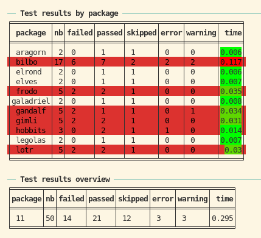

```{r setup, include = FALSE}
## N.B: we need to setup and make available the demo collection of packages "srcpkgs_lotr_demo"

# setup a temp dir
root_dir <- tempfile()
dir.create(root_dir)
file.copy('srcpkgs_lotr_demo', root_dir, recursive = TRUE)
workdir <- file.path(root_dir, 'srcpkgs_lotr_demo')
knitr::opts_knit$set(root.dir = workdir) # set directory for other chunks

# old <- options(width = 200)
```

I will demonstrate srcpkgs using a dummy collection of source packages: https://github.com/kforner/srcpkgs_lotr_demo
It consists currently in 11 related packages, with internal dependencies.
The dependencies are implemented by a mix of Imports, Imports with namespace imports and Depends.


## listing the LOTR collection of packages with srcpkgs

```{r srcpkgs_setup, results = "markup"}
library(srcpkgs)
print(names(get_srcpkgs()))
# cat(clitable::cli_table(as.data.frame(get_srcpkgs())), sep = "\n")
```


## testing the collection 

### no tests yet

The LOTR collection does not come with any test. 
Let's see what happens then...

```{r no_tests, results = "markup"}
print(pkgs_test(reporter = "silent"))
```

So no tests (`nb == 0`) but the testing was successful since no test failed...


### adding dummy tests to the packages

Let's add programmatically some dummy tests to our packages.

```{r dummy_tests}
add_dummy_test_to_srcpkg <- function(srcpkg, with_failures = TRUE, with_errors = TRUE, with_warnings = TRUE) {
  withr::local_dir(srcpkg$path)
  dir.create("tests/testthat", recursive = TRUE, showWarnings = FALSE)

  .write_test <- function(name, code, test = name) {
    writeLines(sprintf(r"-----{
    test_that("%s", {
      %s
    })
    }-----", name, code), sprintf("tests/testthat/test-%s.R", test))
  }

  .write_test("success", "expect_true(TRUE)")
  if (with_failures) {
    .write_test("failure", "expect_true(FALSE)")
    .write_test("mixed", "expect_true(FALSE);expect_true(TRUE)")
  }
  .write_test("skip", 'skip("skipping");expect_true(FALSE)')
  if (with_errors) .write_test("errors", 'expect_true(TRUE);stop("Arghh");expect_true(TRUE)')
  if (with_warnings)  .write_test("warning", 'expect_true(FALSE);warning("watch out");expect_true(FALSE)')
  if (with_failures && with_errors)
    writeLines(r"-----{
    test_that("misc1", {
      expect_true(FALSE)
      expect_true(TRUE)
    })
    test_that("misc2", {
      expect_true(FALSE)
      skip("skipping")
    })
    test_that("misc3", {
      expect_true(TRUE)
      expect_true(TRUE)
    })
    test_that("misc4", {
      expect_true(TRUE)
      warning("fais gaffe")
      stop("aie")
      expect_true(TRUE)
    })
    }-----", "tests/testthat/test-misc.R")

  writeLines(sprintf(r"-----{
    library(testthat)
    library(%s)

    test_check("%s")
  }-----", srcpkg$package, srcpkg$package), "tests/testthat.R")
}
i <- 0
for (pkg in get_srcpkgs()) {
  add_dummy_test_to_srcpkg(pkg, i %% 3 == 1, i %% 7 == 1, i %% 5 == 1)
  i <- i + 1
}
```


### testing

Now let's test again.

```{r with_tests, results = "markup"}
# N.B: we use the silent testthat reporter because we only want to get the results as tables
test_results <- pkgs_test(reporter = "silent")
print(test_results)
```

Note that in markdown we can not have the ANSI colors and formatting. Here's a screenshot



### using the test results

The test results are stored as a `pkgs_test` object, which is a list named after the packages, of `pkg_test` objects
which are a subclass of `testthat_results`.
You can manipulate them with S3 methods:

  - `as.data.frame()` - converts the results to a data frame with one row per package
  - `summary()` - converts the results to a one-row data frame that summarizes the results for the collection of packages
  - `as.logical()` - tells if the overall testing of the collection was successful
  - `print()` - prints the results as pretty tables

These S3 methods are also implemented for `pkg_test` objects.

```{r pkgs_test_methods, results = "markup"}
print(as.data.frame(test_results))
print(summary(test_results))
print(as.logical(test_results))

print(test_results$bilbo)
print(as.data.frame(test_results$lotr))
print(summary(test_results$lotr))
print(as.logical(test_results$aragorn))
```


## checking the collection 

Checking is very similar to testing except that it takes much longer!

### fixing the collection: declare testthat as dependency
```{r fixing}
.fix_description <- function(path, lst) {
  df <- read.dcf(path, all = TRUE)
  df2 <- utils::modifyList(df, lst)
  write.dcf(df2, path)
}
for (pkg in get_srcpkgs()) {
  .fix_description(file.path(pkg$path, "DESCRIPTION"), list(Suggests = "testthat"))
}
```


### checking the packages

```{r checking, results = "markup"}
check_results <- pkgs_check(quiet = TRUE)
print(check_results)
```

### using the check results

The check results are stored as a `pkgs_check` object, which is a list named after the packages, of `pkg_check` objects
which are a subclass of `rcmdcheck`.

As with `pkgs_test` results, you can manipulate them with S3 methods:

  - `as.data.frame()` - converts the results to a data frame with one row per package
  - `summary()` - converts the results to a one-row data frame that summarizes the results for the collection of packages
  - `as.logical()` - tells if the overall testing of the collection was successful
  - `print()` - prints the results as pretty tables

```{r pkgs_check_methods, results = "markup"}
print(as.data.frame(check_results))
print(summary(check_results))
print(as.logical(check_results))

print(check_results$bilbo)
print(as.data.frame(check_results$lotr))
print(summary(check_results$lotr))
print(as.logical(check_results$aragorn))
```

```{r cleanup, include = FALSE}
# options(old)
```

